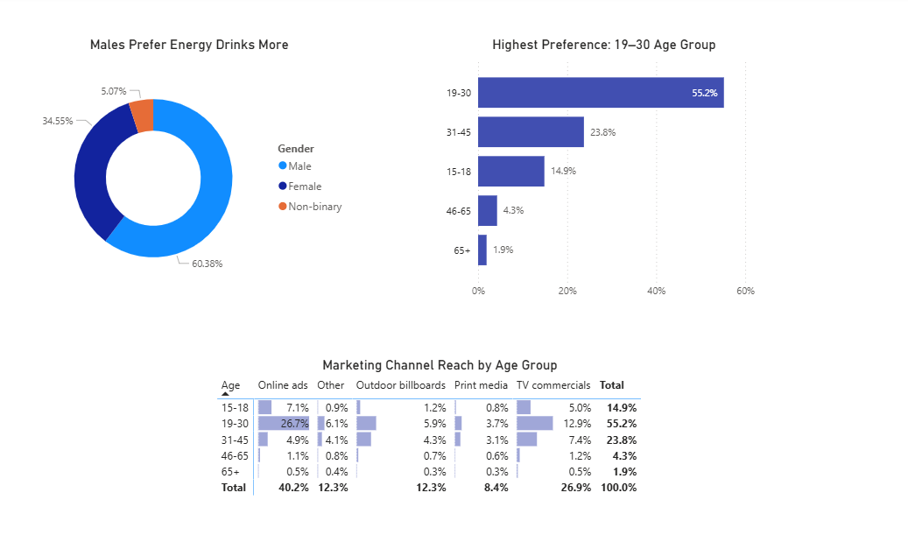
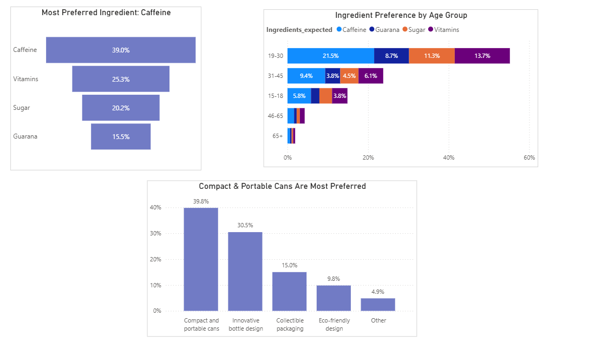
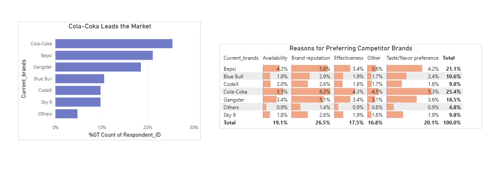
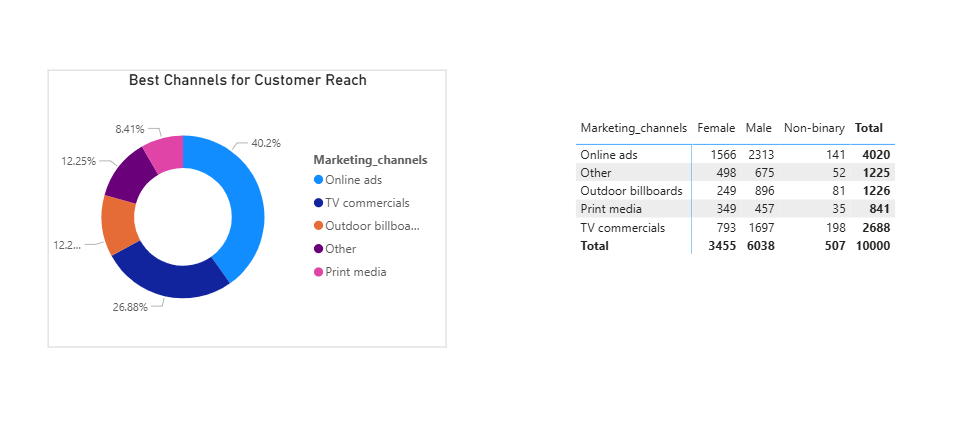
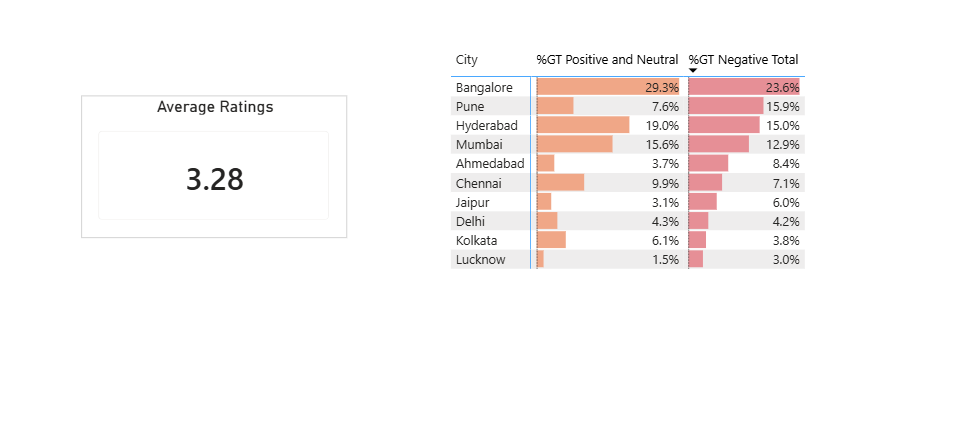
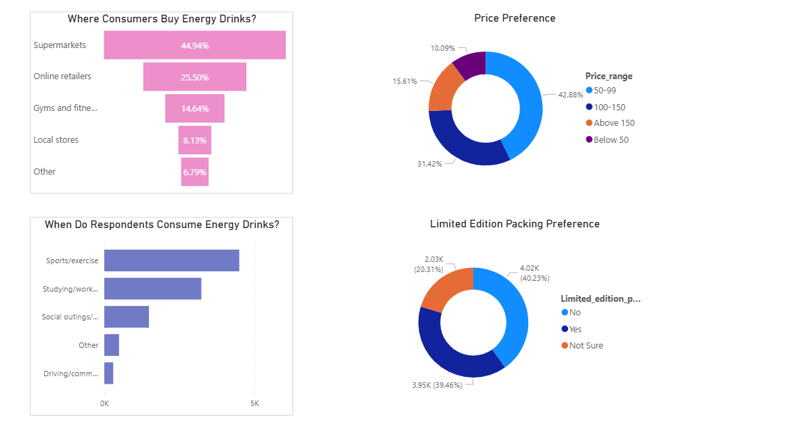
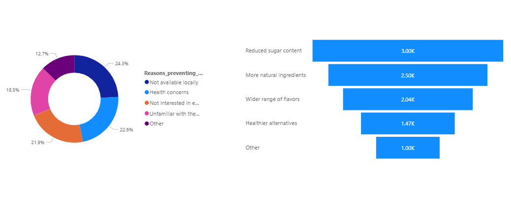
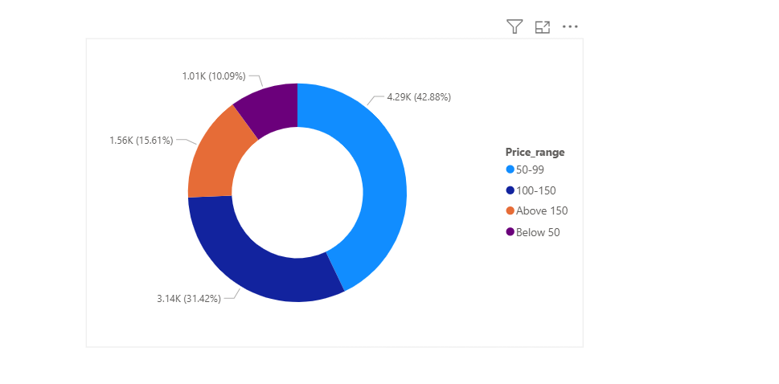
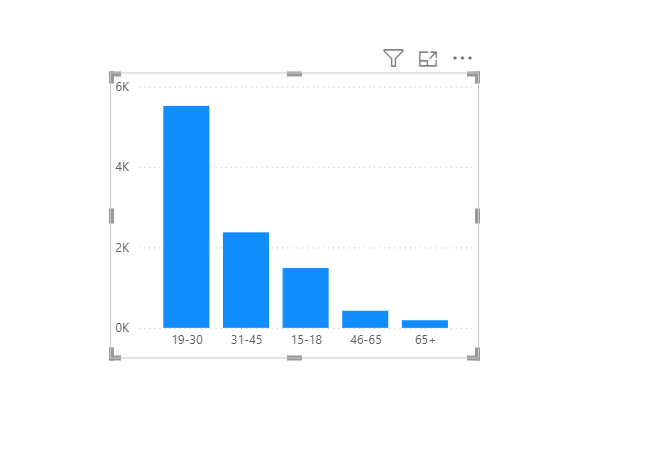

## About The Project

The project is about an imaginary beverage company called CodeX.

CodeX is a German beverage company which is recently launched in India. They launched their energy drink in 10 cities in India.

CodeX conducted a survey in those 10 cities and received results from 10k respondents.
The survey was based on consumer behaviour questions like their purchasing habits, their feedback about energy drinks, available in the market, pricing, packaging etc.

The Marketing team wants the Data Analyst to turn these survey results into clear, actionable insights and provide practical recommendations the team can use.

## Problem Statements & Solutions

### Demographic Insights

#### Who prefers energy drink more? (male/female/non-binary?), Which age group prefers energy drinks more? ,Which type of marketing reaches the most Youth (15-30)?

- Males prefer energy drinks the most, accounting for 60.38% of the total preference.

- The 19–30 age group has the highest preference at 55.2%.

- Online ads reach the most youth, capturing 33.8% of the audience combined (7.1% for ages 15-18 and 26.7% for ages 19-30).

### Consumer Preferences

#### What are the preferred ingredients of energy drinks among respondents? What packaging preferences do respondents have for energy drinks?

- Caffeine is the most preferred ingredient overall at 39.0%, followed by Vitamins (25.3%), Sugar (20.2%), and Guarana (15.5%).

- The 19–30 age group dominates ingredient demand, heavily prioritizing Caffeine and Vitamins over other components.

- Compact and portable cans are the most preferred packaging type at 39.8%, followed by Innovative bottle designs (30.5%), Collectible packaging (15.0%), Eco-friendly designs (9.8%), and Other (4.9%).

### Competition Analysis

#### Who are the current market leaders? What are the primary reasons consumers prefer those brands over ours?

- Cola Coka is leading the market followed by Bepsi. The data shows there more respondents for Cola Coka than the other brands.

- The top reason for choosing the brands by consumers is brand reputation.

### Marketing Channels and Brand Awareness

#### Which marketing channel can be used to reach more customers? How effective are different marketing strategies and channels in reaching our customers?

- As we have seen Online Ads are the most effective way to reach maximum audiences in a short duration & it is cost effective as well.

### Brand Penetration

#### What do people think about our brand? (overall rating) Which cities do we need to focus more on? 

- The brand has an average sentiment rating of 3.3 out of 5, indicating a moderate or neutral-to-slightly positive overall perception.

- We need to focus heavily on Bangalore and Pune. Bangalore has the highest negative sentiment share at 23.6%. Pune stands out critically because its negative sentiment (15.9%) is more than double its positive/neutral sentiment (7.6%)

### Purchase Behavior

#### Where do respondents prefer to purchase energy drinks? What are the typical consumption situations for energy drinks among respondents? What factors influence respondents' purchase decisions, such as price range and limited edition packaging? 

- Supermarkets are the top choice at 44.94%, followed by Online retailers at 25.50%.

- Drinks are mainly consumed during Sports/exercise and Studying/working late.

- Most prefer the 50–99 range (42.88%). Opinions are split, with 40.23% saying No and 39.46% saying Yes to its influence.

### Recommendations for CodeX 

#### What immediate improvements can we bring to the product? 

1. Product Formulation

- Reduce or substitute sugar content to satisfy the top consumer demand (3.00K responses).

- Shift to more natural ingredients (2.50K responses) and market healthier alternatives to alleviate the 22.6% of consumers holding back due to health concerns.

- Launch a broader variety of flavor options (2.04K responses).

2. Distribution & Marketingq

- Solve the single biggest friction point—24.3% of consumers cannot find the product locally.

- Educate and sample to capture the 18.5% who are unfamiliar with the product.

#### What should be the ideal price of our product? 

- The Sweet Spot (50–99): Captures the largest market share at 42.88% (4.29K responses). This is the ideal target for maximum volume.

- The Mid-Tier (100–150): Captures the second-largest share at 31.42% (3.14K responses). This works well if production costs necessitate a more premium price.

#### What kind of marketing campaigns, offers, and discounts we can run? 

- Location-Based Pricing: Experiment with different price points in different cities based on local market dynamics.

- Volume Discounts: Offer a "Pack of 6 Cans" at a cheaper cost to boost volume without lowering the brand's individual product price strategy.

- Festive Gift Sets: Create curated gift packs tailored around major local festivals celebrated throughout the year in each city.

- Social Media Ads
Targeted Ads: Launch online ads specifically targeting the highly active 15–30 age demographic to drive product discovery.

- Influencer Marketing
Micro & Macro Collaborations: Partner with local influencers (ranging from 10k–100k to 100k–500k+ followers) via low-cost cash or barter systems.

- Giveaways: Gift products to influencers and their followers to shift brand perception.

- Exclusive Coupons: Provide unique discount codes through influencers to boost customer retention and lower remarketing costs.

- E-commerce & Online Retailers
PPC Advertising: Run paid ads directly on e-commerce and online grocery platforms to compete with established brands and gain instant visibility.

#### Who should be our target audience, and why?

- It is evident from the statistics that our consumers are mostly between the ages of 15 to 30. From this survey, the count shows that 70% of consumers are youth.

### Datasets

This file contains all the meta information regarding the columns described in the CSV files. We have provided 3 CSV files:

- dim_respondents
- dim_cities
- fact_survey_responses

---

### Notes

- Dataset provided by Codebasics.
- For contributions or issues, please open an issue or submit a pull request.

